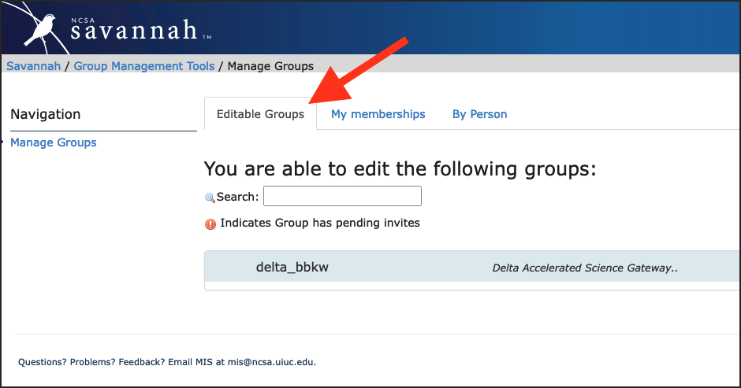

.. _group-mgmt:

Group/Project Member Management
==================================

.. warning::
   To manage a project that was awarded via **ACCESS**, go to `ACCESS Allocations <https://allocations.access-ci.org/>`_.

You use the `NCSA Group Management Tool <https://internal.ncsa.illinois.edu/mis/groups/>`_ to add and remove group members, invite new members to your group, and add delegates.

Your NCSA system allocation likely uses "project" to describe your allocation, for the purposes of the group management tool, "project" and "group" are interchangeable; this page will use "group". 

NCSA Group Management Tool
------------------------------
   
Log in to the `NCSA Group Management Tool <https://internal.ncsa.illinois.edu/mis/groups/>`_ with your NCSA username, Kerberos password, and NCSA Duo MFA.

The **Editable Groups** tab displays the list of groups that you have permission to edit the membership of.  
If you are the PI of an NCSA project, there should be a group on that page with the resource name in the group name. 
Updates to group membership can take up to **1 hour** to propagate to the system.

The user in the following example has permissions to edit one group, bbka_bbkw, which is a project on the Delta resource.

Add NCSA Account Holders to a Group
----------------------------------------

To add a new member, with an existing NCSA account, to a group:

#. In the **Editable Groups** tab, click on the group you want edit.
#. In the **Add Person** field, enter the name or NCSA username of the person you want to add.

   If the person you want to add doesn't have an existing NCSA account, you won't be able to add them; instead, go to :ref:`invite-new`.

#. Click **Add Person**. Updates to group membership can take up to **1 hour** to propagate to the system.

   .. image:: ../images/allocations/savannah-add-person.png
      :alt: Savannah group management tool with the add person field highlighted in a group.
      :width: 750

.. _invite-new:

Invite New Members to a Group
--------------------------------

Instead of adding new members directly, you can send an invite to your group/project. This is particularly useful if you want to add several people at the same time. This is also how you add members that don't have NCSA accounts.

#. In the **Editable Groups** tab, click on the group you want edit.
#. Select the **Invitation Info** tab.
#. View an existing **Group invitation** URL or click **Generate Group Invitation**.

   Note, if you **Re**-generate a group invitation, the old URL will no longer work.

   .. figure:: ../images/allocations/savannah-group-invitation.png
      :alt: Savannah group management tool with the invitation info tab selected for a group. The group invitation URL and re-generate group invitation options are highlighted.
      :width: 750
      :figwidth: 800

#. Share the **Group invitation** URL with people you want to add to your group. From that URL, they will:

   - Log in with an existing NCSA identity or click **Register New User and Join** to create an NCSA identity.
   - Provide any information requested for the group you invited them to.

#. After a person completes the forms at the **Group invitation** URL, the group's **maintainers** will be notified by email. A group maintainer will need to come back to Group Management page to confirm the request to join the group. Updates to group membership can take up to **1 hour** to propagate to the system.

Remove a Member from a Group
---------------------------------

To remove a member from a group, you must be an owner or maintainer of that group. To remove a member:

#. In the **Editable Groups** tab, click on the group you want edit.
#. In the **General Info** tab, click on the red dot in the **Delete** column for the person you want to remove. Updates to group membership can take up to **1 hour** to propagate to the system.

   .. image:: ../images/allocations/savannah-delete-person.png
      :alt: Savannah group management tool with the general info tab selected for a group and the delete column highlighted.
      :width: 750

Add a Delegate to a Group
-----------------------------

Group owners can add delegates to a project to help manage adding and removing members. To add a delegate:

#. In the **Editable Groups** tab, click on the group you want edit.
#. In the **General Info** tab, click **View/Modify group maintainers**.  

   .. figure:: ../images/allocations/savannah-modify-maintainers.png
      :alt: Savannah group management tool with the general info tab selected and the view/modify group maintainers button highlighted.
      :width: 750
      :figwidth: 800

#. Under **Maintainers**, enter the name or NCSA account of person you want to make a delegate and click **Add Maintainer**.

   Anyone you add to this maintainer list will have full permissions to manage the group's membership and invites until they are removed by the **group owner**.

   .. image:: ../images/allocations/savannah-maintainers.png
      :alt: Savannah group management tool with the add person field highlighted under maintainers.
      :width: 750

|
