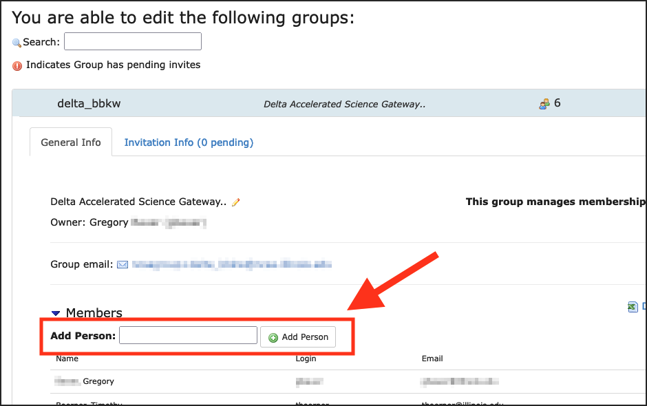
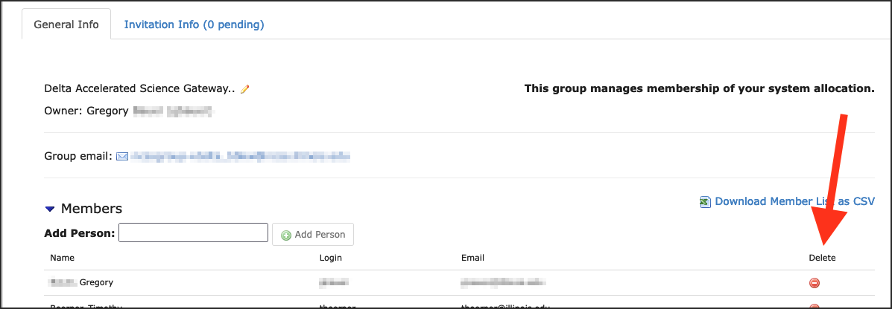

.. _group-mgmt:

Group/Project Member Management
==================================

.. warning::
   To manage a project that was awarded via **ACCESS**, go to `ACCESS Allocations <https://allocations.access-ci.org/>`_.

.. note::
   Your NCSA system allocation may use "project" to describe your allocation account, for the purposes of the group management tool, "project" and "group" are interchangeable; this page will use "group". 

You use the `NCSA Group Management Tool <https://internal.ncsa.illinois.edu/mis/groups/>`_ to add and remove group members, invite new members to your group, and add delegates.

NCSA Group Management Tool
------------------------------

You log in to the `NCSA Group Management Tool <https://internal.ncsa.illinois.edu/mis/groups/>`_ with your NCSA username, Kerberos password, and NCSA Duo MFA.

The **Editable Groups** tab displays the list of groups that you have permission to edit the membership of.  
If you are the PI of a NCSA project (on Delta, Radiant, Nightingale) you should find a group on that page with the appropriate resource name in the group name.

Note, updates to the group membership can take up to **1 hour** to propagate to the system.

The user in the following example has permissions to edit one group, bbka_bbkw.

.. image:: ../images/allocations/savannah-editable-groups.png
   :alt: The Savannah group management tool opened with the editable groups tab selected.
   :width: 750

Add NCSA Account Holders to a Group
----------------------------------------

.. note::
   If the person you want to add doesn't have an NCSA account go to :ref:`invite-new` to learn how to invite them to create one. 

To add a new user, with an existing NCSA account, to your group:

#. In the **Editable Groups** tab, click on the group you want edit.
#. In the **Add Person** field, enter the name or NCSA account of the person you want to add.

   If the person you want to add, doesn't have an existing NCSA account, you won't be able to add them. Go to :ref:`invite-new`.

#. Click **Add Person**.  

.. _invite-new:

Invite New Users to a Group
--------------------------------

Instead of adding new users directly, you can send them an invite to your group/project. This is particularly useful if you want to add several people at the same time. This is also how you add users that don't have existing NCSA accounts.

#. In the **Editable Groups** tab, click on the group you want edit.
#. Select the **Invitation Info** tab.
#. View an existing **Group invitation** URL or click **Generate Group Invitation**, if one doesn't exist.

   Note, if you **Re**-generate a group invitation, the old URL will no longer work.

   .. image:: ../images/allocations/savannah-group-invitation.png
      :alt: Savannah group managment tool with the invitation info tab selected for a group. The gropu invitation URL and re-generate group invitation options are highlighted.
      :width: 750

#. Share the **Group invitation** URL with people you want to add to your group. From that URL, they will:

   - Log in with an existing NCSA identity or click **Register New User and Join** to create an NCSA identity.
   - Provide any information requested for the group you invited them to.

#. After the user completes the forms at the **Group invitation** URL, the group's maintainers will be notified by email. A group maintainer will need to come back to Group Management page to confirm their request to join your group.

Remove a Member from a Group
---------------------------------

To remove a user from a group:

#. In the **Editable Groups** tab, click on the group you want edit.
#. In the **General Info** tab, click on the red dot in the **Delete** column for the person you want to remove.

Add a Delegate to a Group/Project
---------------------------------------

Project owners can add delegates to a project to help manage adding and removing account members. To add a delegate:

#. Select the Editable Groups tab.
#. Select the group you want to invite users to.
#. Click the box that says "View/Modify group maintainers".  
#. Enter the name or NCSA account of the delegate.

   Anyone you add in this maintainer set will have full permissions to manage the group membership and invites until they are removed by the **group owner**.

.. image:: 
   :alt: Savannah group management tools add a delegate example.
   :width: 750

|
