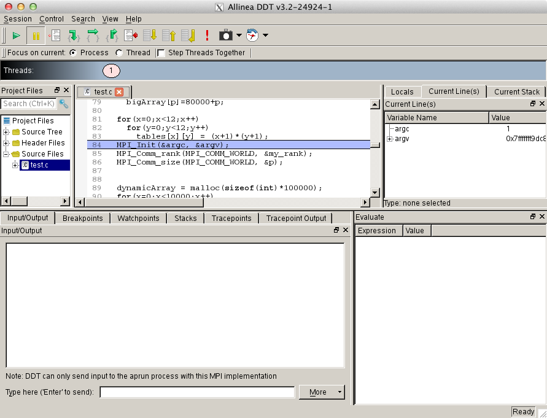

.. _forge_interactive:

Forge (formerly known as DDT: Distributed Debugging Tool)
========================================================

Description
-------------

Forge from ARM (formerly Allinea Software) is a parallel debugger that can be used for scalar, multi-threaded and large-scale parallel applications. 
The `Allinea DDT <http://www.allinea.com/products/ddt-support>`_ web page and `user guide <http:content.allinea.com/downloads/userguide.pdf>`_ is a good resource for learning more about some of the advanced DDT features. 
Helpful `videos <http://www.allinea.com/videos>`_ and `blogs <http://www.allinea.com/blog>`_ are available from the Allinea website.

-  DDT Interactive Use (:ref:`forge_interactive`)
-  DDT Offline (:ref:`forge_offline`)
-  DDT Remote (:ref:`forge_remote`)

How to use Forge/DDT
-----------------------

Prerequisites
~~~~~~~~~~~~~~

Since Forge/DDT is GUI-based and does not provide command line interface, X11 forwarding must be enabled for your login session. This can be done by passing ``-Y`` flag to SSH:

.. code-block::

   > ssh -Y bw-duo.ncsa.illinois.edu

For **memory debugging**, load the memory debugging module for Forge/DDT **before** linking.

No memory debugging:

.. code-block::

   > module load forge 

or

With memory debugging:

.. code-block::

   > module load ddt-memdebug

Compilation
~~~~~~~~~~~~~

Add ``-g`` flag to enable the generation of debugging information used by DDT, then (re)compile your program.

Fortran example:

.. code-block::

   > ftn -g test.f90 -o test

C example:

.. code-block::

   > cc -g test.c -o test

Starting a debug session with DDT
~~~~~~~~~~~~~~~~~~~~~~~~~~~~~~~~~~~~

There are multiple methods to start a debug session with DDT:

-  Submit a job through DDT
-  Manually launch a program with DDT
-  Attach DDT to a running program
-  Start a debug session from inside an interactive job

The first three ways begin by loading the ddt module and starting DDT:

.. code-block::

   > module unload altd ; module unload xalt
   > module load ddt-memdebug # (note the use of the ddt-memdebug module from above)
   > export DDT_NODE_SCAN_TIMEOUT=90
   > export DDT_NO_TIMEOUT=1
   > export DDT_PROCESS_TIMEOUT=0
   > forge

.. image:: images/ddt-welcome.png

Submit a job through Forge/DDT
$$$$$$$$$$$$$$$$$$$$$$$$$$$$$$$$

Submitting a job through Forge/DDT, submits a job, waits until the job is scheduled, and starts a debug session.

#. Click on **Run and Debug a Program**. A new window with expandable tabs will appear.
#. Click on **Details...** to expand a tab.

   .. image:: images/ddt-run.png

The **Application** tab is used to select a program binary, working directory, arguments, and input file.

The **MPI**, **OpenMP**, **CUDA** and **Memory Debugging** tabs are used to allow respective features and set parameters such as number of nodes and processes per node, for an MPI program.

The **Queue Submission Parameters** tab is used to change job parameters such as wall clock time and target queue.

Clicking on **Submit** button will submit a job to the scheduler, DDT will wait for the job to start.

DDT will start a debug session automatically as soon as the job starts.

Manually launch a program
$$$$$$$$$$$$$$$$$$$$$$$$$$$$$

Manual launch allows debugging multi-process and multi-executable programs.

To launch a program manually:

#. Click on Manually Launch a Program button.

   .. image:: images/ddt-manual.png

#. Select how many processes you want to debug and click on **Listen**. 

#. Start a program or programs using the following command:

   .. code-block::

      > forge-client <path-to-program-binary>

   ``ddt-client`` command must be issued for each process selected at the previous window. The above command can also be used in a job submission script.

   .. image:: images/ddt_connecting1.png

   .. image:: images/ddt_connecting2.png

#. Forge/DDT will automatically start debugging session once all requested programs have been launched manually.

Attach to a running program
$$$$$$$$$$$$$$$$$$$$$$$$$$$$$$

To attach to a program that is already running:

#. Click on the **ATTACH - Attach to an already running program** button.

   With nodes=256 or more, start ddt from the command line with:

   .. code-block::
  
      DDT_NODE_SCAN_TIMEOUT=90 dd

#. DDT will scan each of the 64 mom nodes and locate all of the active jobs that you own, which will appear in the **Automatically-detected jobs** tab. 

#. Select the desired job, and click on the **Attach to [job name]** button.

   .. image:: images/ddt-attach2.png

   Alternatively, you can attach to a specific process that you own on the **List of all processes** tab.

   .. image:: images/ddt-attach.png

#. If you are unable to attach to running jobs or processes (if they aren't listed), clear out all previously saved Forge settings by:

   i.   Removing the **~/.allinea** directory
   ii.  Quit Forge and reload it
   iii. Try attaching again.

Start a debug session from inside an interactive job
$$$$$$$$$$$$$$$$$$$$$$$$$$$$$$$$$$$$$$$$$$$$$$$$$$$$$$$

To start DDT from an interactive job:

#. Enable X11 forwarding (``-X`` flag):

   .. code-block::

      > qsub -I -X

#. Once the job has started, load the ddt module and start DDT with ``-noqueue`` flag:

   .. code-block::

      > module load ddt-memdebug
      > forge -noqueue

#. Click on **Run and Debug a Program**. A new window with expandable tabs will appear. Tabs **Application**, **MPI**, **OpenMP**, **CUDA** and
**Memory Debugging** are the same as described above.

   .. image:: images/ddt-run-noqueue.png

#. Click on Run button to start a debug session.

.. toctree::

   offline
   remote
