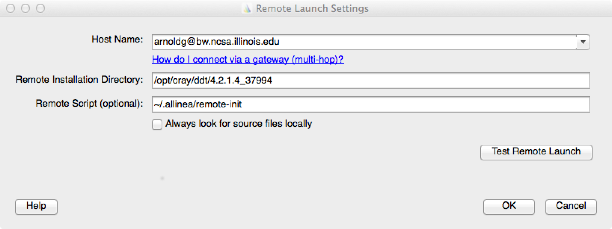
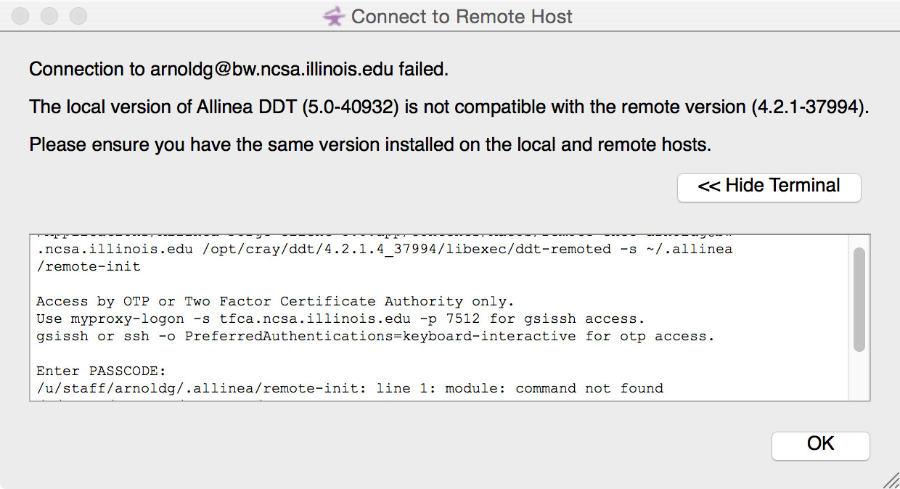
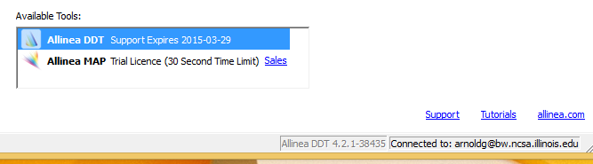
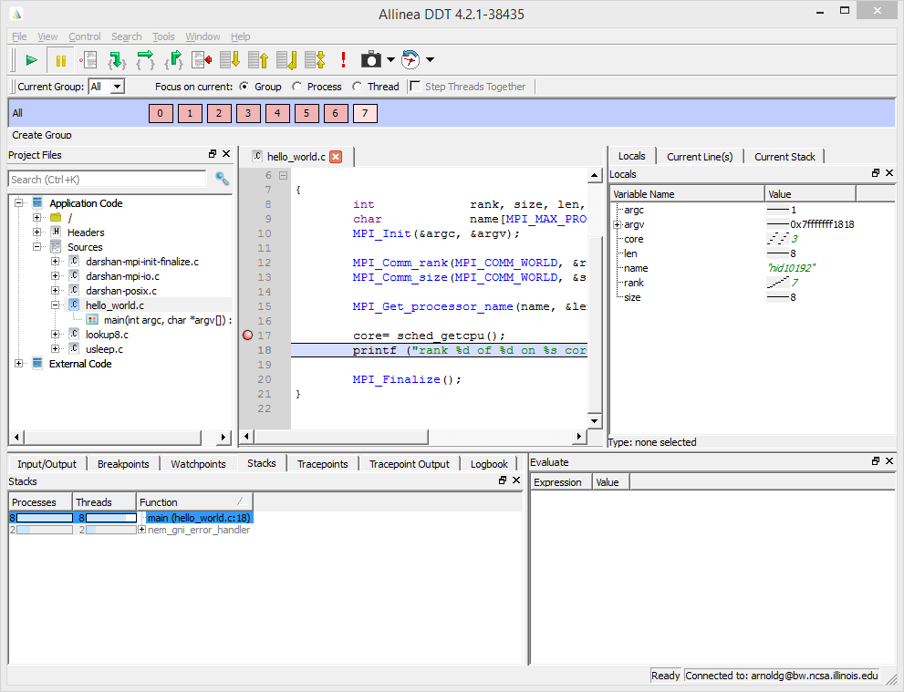

.. _forge_remote:

Forge (DDT) Remote Client
~~~~~~~~~~~~~~~~~~~~~~~~~~~~~~~~

The Allinea Tools can connect to remote systems using SSH for you so you
can run the user interface on your desktop or laptop machine without the
need for X forwarding. Native remote clients are available for Windows,
Mac OS X and Linux.

Navigate to the "Remote Clients" near the end of the URL below and
download the remote client for your desktop/laptop system :

http://www.allinea.com/products/ddt/download

*At this time, you may need to choose a version from the "Remote client
downloads for older versions" further down that page in order to get a
version that closely matches the versions we have on the system.*

.. table:: Installation notes

            +--------------------------------+------------------------------------+
            | MacOS 10.9.5                   | You will need to right-click and   |
            |                                | open the application to allow it   |
            |                                |                                    |
            |                                | to run since it's not from the App |
            |                                | store.                             |
            +--------------------------------+------------------------------------+
            | Windows 8.1                    | You will need to click the "more   |
            |                                | info" link of the pop-up dialog    |
            |                                |                                    |
            |                                | from the Windows Protected screen  |
            |                                | and "Run anyway" because the       |
            |                                |                                    |
            |                                | package is not signed.             |
            +--------------------------------+------------------------------------+
            | Linux Mint 17 (Ubuntu variant) | No issues with installation        |
            +--------------------------------+------------------------------------+

Change the Remote Launch: Configure... settings to use the
version of ddt that most closely matches the downloaded client
version. You can check the available ddt versions on Blue
Waters with the "module avail" command and see the Remote
Installation Directory path with "module show ddt/..." . Drop
the trailing "/bin" from the PATH shown in the module output.
Add the module commands you want to use with your debug session
to ~/.allinea/remote-init file (and any other shell or
environment settings you prefer). Here is an example
remote-init :

.. container:: table-wrap

            +-----------------------------------------------------------------------+
            | $ cat ~/.allinea/remote-init                                          |
            |                                                                       |
            | module unload darshan                                                 |
            |                                                                       |
            | module load ddt/4.2.1.4_37994                                         |
            |                                                                       |
            | export DDT_NODE_SCAN_TIMEOUT=90                                       |
            |                                                                       |
            | export DDT_NO_TIMEOUT=1                                               |
            |                                                                       |
            | export DDT_PROCESS_TIMEOUT=0                                          |
            |                                                                       |
            | .. container::                                                        |
            +-----------------------------------------------------------------------+

Select the "Test Remote Launch" button, authenticate, and you
should see a dialog similar to:

.. container:: table-wrap

            +-----------------------------------------------------------------------+
            | Remote Launch test completed successfully.                            |
            |                                                                       |
            | Hostname: h2ologin1                                                   |
            |                                                                       |
            | OS: SUSE Linux Enterprise Server 11 (x86_64)                          |
            |                                                                       |
            | Version: 4.2.1-37994                                                  |
            +-----------------------------------------------------------------------+

If you see an error similar to the one below, go back to the
downloads page and scroll down to the area where you can
download previous versions of the remote client.

After you have connected to the system, the lower-right portion
of the window will display connection status. You may now use
ddt normally as if you were running directly on the remote
system. If you have previous Run configurations they will be
automatically discovered and available. The next time you use
the DDT Remote Client just select your
username@bw.ncsa.illinois.edu session from the "Remote Launch"
options in the middle of the startup window.

Example session connected with the remote client:

For more information please see the Allinea documentation on
installation (chapter 2) and remote client (chapter 3) in the
`DDT User Guide <http://%20http://content.allinea.com/downloads/userguide.pdf>`__.
