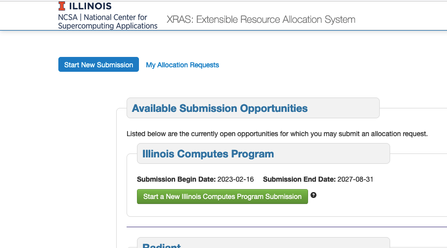

.. _xras-new:

How to Request a New Allocation in the NCSA XRAS Portal
==========================================================

.. note::
   If you don't already have an NCSA account, `create an NCSA Kerberos account <https://identity.ncsa.illinois.edu/join/ETGX7ICQAX>`_. Once requested, Kerberos account creation may take up to 24 hours.

#. Log into the `NCSA XRAS portal <https://xras-submit.ncsa.illinois.edu>`_ with your NCSA account username and Kerberos password.

#. In the "Start New Submission" tab, find the resource you'd like to use and click **Start a New <Resource> Submission**.

#. Fill out the submission form, providing as much detail as possible.

   In the **Documents** section, if you **do not** want to submit any supporting documents, click **Remove** and any "required" document fields will no longer be required to submit the form.

#. Click **Submit**.

   The associated resource admin group will review your submission and follow up via email if they have any questions or need any additional information.

   You can expect to hear back with a decision on your allocation request within 10 business days of submission (this may be longer if you have been asked to provide additional information).

|
