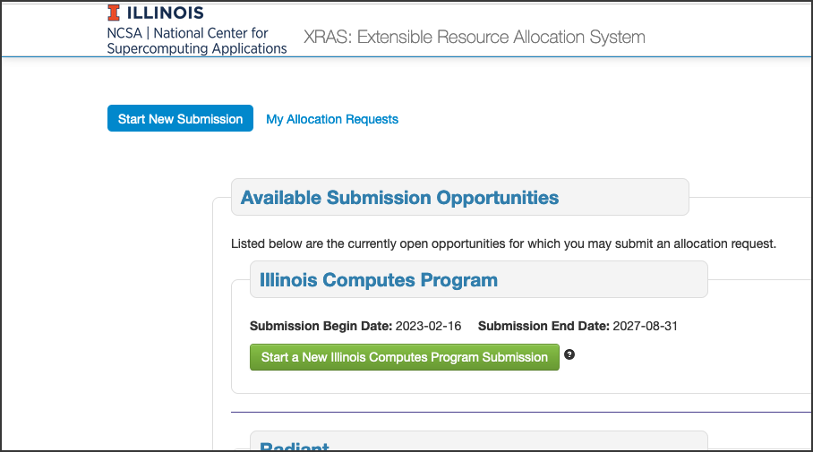

.. _xras-new:

How to Request a New Allocation in the NCSA XRAS Portal
==========================================================

.. note::
   If you don't already have an NCSA account, `create an NCSA Kerberos account <https://identity.ncsa.illinois.edu/join/ETGX7ICQAX>`_.

   Account creation may take up to 24 hours once requested, please plan accordingly.

#. Log into the `NCSA XRAS portal <https://xras-submit.ncsa.illinois.edu>`_ with your NCSA account username and Kerberos password.

#. Find the resource you'd like to use and click the **Start a New <Resource> Submission** button.

#. Fill out the submission form, providing as much detail as possible.

   In the **Documents** section, if you do **not** want to submit any supporting documents, click the orange **Remove** button and any "required" document fields will no longer be required to submit the form.

#. Click the **Submit** button.

   The associated resource admin group will review your submission and followup via email if they have any questions or need any additional information.

   You can expect to hear back with a decision on your allocation request within 10 business days of submission (this may be longer if you have been requested to provide additional information).

