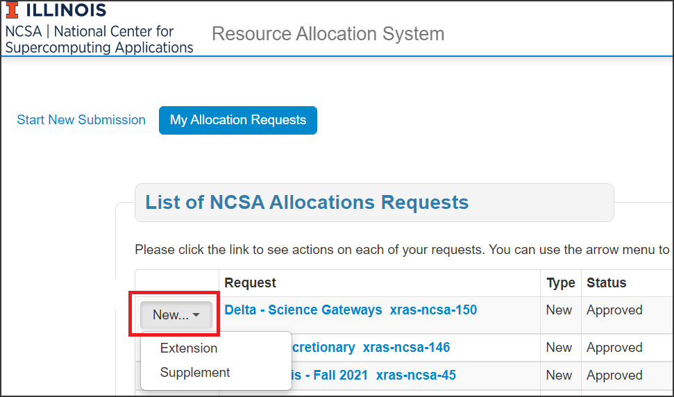

:nosearch:

.. _xras-renew:

How to Request an Extension or Supplement to an Allocation
============================================================

#. Log into the `NCSA XRAS portal <https://xras-submit.ncsa.illinois.edu>`_ with your NCSA account username and Kerberos password.

#. Click **My Allocation Requests** at the top of the page.

#. Find the allocation/project that you want to request an extension or supplement to in the **List of NCSA Allocation Requests** table.

#. In the dropdown menu to the left of the allocation/project, select **Extension** or **Supplement**.

#. Fill out the form and click **Submit**.

   You can expect to hear back with a decision on your request within 10 business days of submission (this may be longer if you have been asked to provide additional information).

|
