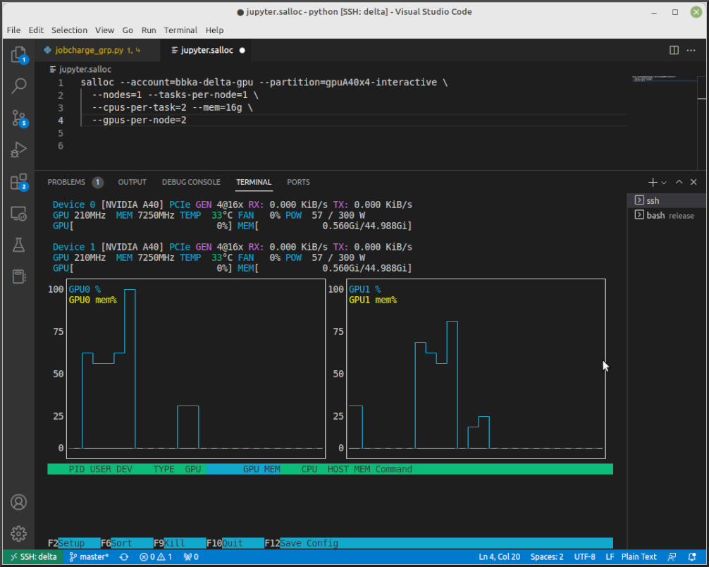

.. _slurm:

Job Management with Slurm
=================================

NCSA computer systems use the Slurm software stack for job workload management. 

.. _access_nodes:

Accessing the Compute Nodes
-------------------------------

Use the Slurm commands to run batch jobs or for interactive access to compute nodes. 
See the `Slurm Quick Start User Guide <https://slurm.schedmd.com/quickstart.html>`_ for an introduction to Slurm. 
A summary guide to Slurm commands is also available for download: :download:`Slurm Command Summary <images/slurm/slurm_summary.pdf>`

Batch scripts (sbatch) or Interactive (srun , salloc), which is right for you?

- :ref:`sbatch`: Use batch scripts for jobs that are debugged, ready to run, and don't require interaction.
  Sample Slurm batch job scripts are provided in the :ref:`examples` section.
  For mixed resource heterogeneous jobs see the `Slurm heterogeneous jobs documentation <https://slurm.schedmd.com/heterogeneous_jobs.html#submitting>`_. 
  Slurm also supports job arrays for easy management of a set of similar jobs, see the `Slurm job arrays documentation <https://slurm.schedmd.com/job_array.html>`_.

- :ref:`srun`: For interactive use of a compute node, ``srun`` will run a single command through Slurm on a compute node. ``srun`` blocks, it will wait until Slurm has scheduled compute resources, and when it returns, the job is complete.

- :ref:`salloc`: Also interactive, use ``salloc`` when you want to reserve compute resources for a period of time and interact with them using multiple commands. Each command you type after your salloc session begins will run on the login node if it is just a normal command, or on your reserved compute resources if prefixed with ``srun``.  Type **exit** when finished with an salloc allocation if you want to end it before the time expires.

Direct SSH access to a compute node in a running job from a dt-loginNN node is enabled once the job has started:

.. code-block::

   $ squeue --job jobid
                JOBID PARTITION     NAME     USER ST       TIME  NODES NODELIST(REASON)
                12345       cpu     bash   gbauer  R       0:17      1 cn001

Then in a terminal session:

.. code-block::

   $ ssh cn001
   cn001.delta.internal.ncsa.edu (172.28.22.64)
     OS: RedHat 8.4   HW: HPE   CPU: 128x    RAM: 252 GB
     Site: mgmt  Role: compute
   $

See also, :ref:`mon_node`.

.. _partitions:

Partitions (Queues)
-----------------------

Each resource has partitions (queues) with different specifications including maximum number of nodes, maximum wall time, and memory. Consult the documentation for your desired resource for more information on its queues.

- `Delta Queues <https://docs.ncsa.illinois.edu/systems/delta/en/latest/user_guide/running_jobs.html#partitions-queues>`_
- `Hydro Queues <https://ncsa-hydro-documentation.readthedocs-hosted.com/en/latest/partitions_and_job_policies.html#partitions-queues>`_
- `ICC Queues <https://docs.ncsa.illinois.edu/systems/icc/en/proposed_changes/user_guide/running_jobs.html#queues>`_
- `Nightingale Queues <https://ncsa-nightingale.readthedocs-hosted.com/en/latest/user_guide/running_jobs.html#nightingale-queues>`_

Node Sharing
--------------

Node-sharing is the default for jobs. 
Node-exclusive mode can be obtained by specifying all the consumable resources for that node type or adding the following Slurm options:

.. code-block::

   --exclusive --mem=0

Job Submission
----------------

.. _sbatch:

sbatch
~~~~~~~~

Batch jobs are submitted through a *job script* (as in the :ref:`examples`) using the ``sbatch`` command. 
Job scripts generally start with a series of Slurm *directives* that describe requirements of the job, such as number of nodes and wall time required, to the batch system/scheduler. Slurm directives can also be specified as options on the sbatch command line; command line options take precedence over those in the script. 
The rest of the batch script consists of user commands.

The syntax for submitting a batch job with ``sbatch`` is:

.. code-block::

  sbatch [list of sbatch options] script_name

The main ``sbatch`` options are listed below. 

+-------------------------+------------------------------------------------------------------+
| Option                  | Description                                                      |
+=========================+==================================================================+
| ``--time=time``         | time = maximum wall clock time (d-hh:mm:ss) [default: 30 minutes]|
+-------------------------+------------------------------------------------------------------+
| ``--nodes=n``           | Total number of nodes for the batch job.                         |
|                         |                                                                  |
|                         | n = number of 64-core nodes [default: 1 node]                    |
+-------------------------+------------------------------------------------------------------+
| ``--ntasks=p``          | Total number of cores for the batch job.                         |
|                         |                                                                  |
|                         | p = number of cores per job to use (1 - 64) [default: 1 core]    |
+-------------------------+------------------------------------------------------------------+
| ``--ntasks-per-node=p`` | Number of cores per node.                                        |
|                         |                                                                  |
|                         | p = number of cores per node to use (1 - 64) [default: 1 core]   |
+-------------------------+------------------------------------------------------------------+

**Example:**

.. code-block::

   --time=00:30:00 
   --nodes=2 
   --ntasks=32

or 

.. code-block::

   --time=00:30:00 
   --nodes=2 
   --ntasks-per-node=16

See the sbatch `man page <https://en.wikipedia.org/wiki/Man_page>`_ for additional information.

.. _srun:

srun
~~~~~~

.. _interactive:

Command Line
$$$$$$$$$$$$$

Instead of queuing up a batch job to run on the compute nodes, you can request that the job scheduler allocate you to a compute node **now** and log you onto it. These are called **interactive batch jobs**. Projects that have dedicated interactive nodes, do not need to go through the scheduler; members of these projects just log in directly to their nodes.

To launch an interactive batch job using the job scheduler with the default values for the job resources (nodes, cores, memory, and so on), run the following command, replacing **ALL_ACCT**, with the name of your allocation account:

.. code-block::

   srun -A ALL_ACCT --pty bash 

.. warning::
   End the interactive job **as soon as you're done**, by typing ``exit``. If you leave the job running, even if you are not running any processes, your allocation account is being charged for the time.

To specify resources for your interactive batch job the ``srun`` command syntax should look similar to the following, replacing **ACCT_NAME** with the name of your charge account. This example will run an interactive batch job in the CPU partition (queue) with a wall clock limit of **30 minutes**, using **one node** and **16 cores per node**. You can also use other ``sbatch`` options:

.. code-block::

  srun --account=ACCT_NAME --partition=cpu --time=00:30:00 --nodes=1 --ntasks-per-node=16 --pty /bin/bash

As another example, the following command will run an interactive job, on **Delta**, in the gpuA100x4 or gpuA40x4 partition with a wall-clock time limit of 30 minutes, using one node and 16 cores per node and 1 GPU:

.. code-block::

   srun -A ALL_ACCT --time=00:30:00 --nodes=1 --ntasks-per-node=16 \
   --partition=gpuA100x4,gpuA40x4 --gpus=1 --mem=16g --pty /bin/bash

After you enter the command, you will have to wait for Slurm to start the job. You will see output similar to:

.. code-block::

   srun: job 123456 queued and waiting for resources

Specifying a small number of nodes for smaller amounts of time should shorten the wait time because such jobs will backfill among larger jobs. Once the job starts, you will see something similar to the below and will be presented with an interactive shell prompt on the launch node. At this point, you can use the appropriate command(s) to start your program.

.. code-block::

   srun: job 123456 has been allocated resources

When you are done with your interactive batch job session, use the ``exit`` command to end the job.

srun Examples
^^^^^^^^^^^^^^

- Single core with 16GB of memory, with one task on a CPU node

  .. code-block::

     srun --account=account_name --partition=cpu-interactive \
       --nodes=1 --tasks=1 --tasks-per-node=1 \
       --cpus-per-task=4 --mem=16g \
       --pty bash

- Single core with 20GB of memory, with one task on a *Delta* A40 GPU node

  .. code-block::

     srun --account=account_name --partition=gpuA40x4-interactive \
       --nodes=1 --gpus-per-node=1 --tasks=1 \
       --tasks-per-node=16 --cpus-per-task=1 --mem=20g \
       --pty bash 

Batch Script
$$$$$$$$$$$$$$

Inside a batch script if you want to run multiple copies of a program you can use the ``srun`` command followed by the name of the executable: 

.. code-block::

   srun ./a.out

By default, the total number of copies run is equal to number of cores specified in the batch job resource specification.
You can use the ``-n``  flag/option with the ``srun`` command to specify the number of copies of a program that you would like to run; the value for the ``-n`` flag/option must be less than or equal to the number of cores specified for the batch job.

.. code-block::

   srun -n 10 ./a.out

.. _salloc:

salloc
~~~~~~~

While interactive like ``srun``, ``salloc`` allocates compute resources for you, while leaving your shell on the login node. Run commands on the login node as usual, use ``exit`` to end a salloc session early, and use ``srun`` with no extra flags to launch processes on the compute resources.

.. code-block::

   $ salloc --mem=16g --nodes=1 --ntasks-per-node=1 --cpus-per-task=2 \
     --partition=gpuA40x4-interactive,gpuA100x4-interactive \
     --account=your_account_name --time=00:30:00 --gpus-per-node=1
   salloc: Pending job allocation 2323230
   salloc: job 2323230 queued and waiting for resources
   salloc: job 2323230 has been allocated resources
   salloc: Granted job allocation 2323230
   salloc: Waiting for resource configuration
   salloc: Nodes gpub073 are ready for job
   $ hostname #<-- on the login node
   dt-login03.delta.ncsa.illinois.edu
   $ srun bandwidthTest --htod #<-- on the compute resource, honoring your salloc settings
   CUDA Bandwidth Test - Starting...
   Running on...

   Device 0: NVIDIA A40
   Quick Mode

   Host to Device Bandwidth, 1 Device(s)
   PINNED Memory Transfers
   Transfer Size (Bytes)        Bandwidth(GB/s)
   32000000                     24.5

   Result = PASS
   $ exit
   salloc: Relinquishing job allocation 2323230

MPI Interactive Jobs: Use salloc Followed by srun
~~~~~~~~~~~~~~~~~~~~~~~~~~~~~~~~~~~~~~~~~~~~~~~~~~

Interactive jobs are already a child process of ``srun``, therefore, one cannot srun (or mpirun) applications from within them. 
Within standard batch jobs submitted via ``sbatch``, use ``srun`` to launch MPI codes. 
For true interactive MPI, use ``salloc`` in place of srun shown above, then **srun my_mpi.exe** after you get a prompt from salloc (``exit`` to end the salloc interactive allocation).

.. raw:: html

   

   
<a><b>interactive MPI, salloc and srun</b> <i>(click to expand/collapse)</i></a>

.. code-block::

   [arnoldg@dt-login01 collective]$ cat osu_reduce.salloc
   salloc --account=bbka-delta-cpu --partition=cpu-interactive \
     --nodes=2 --tasks-per-node=4 \
     --cpus-per-task=2 --mem=0

   [arnoldg@dt-login01 collective]$ ./osu_reduce.salloc
   salloc: Pending job allocation 1180009
   salloc: job 1180009 queued and waiting for resources
   salloc: job 1180009 has been allocated resources
   salloc: Granted job allocation 1180009
   salloc: Waiting for resource configuration
   salloc: Nodes cn[009-010] are ready for job
   [arnoldg@dt-login01 collective]$ srun osu_reduce

   # OSU MPI Reduce Latency Test v5.9
   # Size       Avg Latency(us)
   4                       1.76
   8                       1.70
   16                      1.72
   32                      1.80
   64                      2.06
   128                     2.00
   256                     2.29
   512                     2.39
   1024                    2.66
   2048                    3.29
   4096                    4.24
   8192                    2.36
   16384                   3.91
   32768                   6.37
   65536                  10.49
   131072                 26.84
   262144                198.38
   524288                342.45
   1048576               687.78
   [arnoldg@dt-login01 collective]$ exit
   exit
   salloc: Relinquishing job allocation 1180009
   [arnoldg@dt-login01 collective]$ 

.. raw:: html

   

|

Interactive X11 Support
~~~~~~~~~~~~~~~~~~~~~~~~~

To run an X11 based application on a compute node in an interactive session, the use of the **--x11** switch with ``srun`` is needed. 
For example, to run a single core job that uses 1G of memory with X11 (in this case an xterm) do the following:

.. code-block::

   srun -A abcd-delta-cpu  --partition=cpu-interactive \
     --nodes=1 --tasks=1 --tasks-per-node=1 \
     --cpus-per-task=2 --mem=16g \
     --x11  xterm

Job Management
----------------

sview 
~~~~~~~

`sview <https://slurm.schedmd.com/sview.html>`_ is a graphical user interface (GUI) that can be used to view job, node and partition (queue) states. Run the ``sview`` command to initiate the GUI.

..  figure:: images/slurm/sview-sinfo.png
    :alt: sview view of Slurm partitions

squeue
~~~~~~~

The ``squeue`` command is used to pull up information about batch jobs submitted to the batch system. By default, the ``squeue`` command will print out the JobID,  partition, username, job status, number of nodes, and name of nodes for all batch jobs queued or running within batch system.

============================ ============
Slurm Command                Description
============================ ============
``squeue -a``                List the status of all batch jobs in the batch system.
``squeue -u $USER``          List the status of all your batch jobs in the batch system.
``squeue -j JobID``          List nodes allocated to a specific running batch job in addition to basic information.
``scontrol show job JobID``  List detailed information on a particular batch job.
============================ ============

See the squeue man page for other available options.

.. code-block::

   $ sbatch tensorflow_cpu.slurm
   Submitted batch job 2337924
   $ squeue -u $USER
             JOBID PARTITION     NAME     USER ST       TIME  NODES NODELIST(REASON)
           2337924 cpu-inter    tfcpu  mylogin  R       0:46      1 cn006

If the **NODELIST(REASON)** is **MaxGRESPerAccount**, that means that a user has exceeded the number of cores or GPUs allotted per user or project for a given partition.

sinfo
~~~~~~~

The ``sinfo`` command is used to view partition and node information for a system running Slurm.

+------------------------+----------------------------------------------------------+
| Slurm Command          | Description                                              |
+========================+==========================================================+
| ``sinfo -a``           | List summary information on all the partitions (queues). |
+------------------------+----------------------------------------------------------+
| ``sinfo -p PRTN_NAME`` | Print information only about the specified partition(s). |
|                        |                                                          |
|                        | Multiple partitions are separated by commas.             |
+------------------------+----------------------------------------------------------+

See the sinfo man page for other available options (``man sinfo``).

scontrol
~~~~~~~~~

The ``scontrol`` command can be used to view detailed information on a particular job.

+-------------------------+-------------------------------------------+
| Slurm Example Command   | Description                               |
+=========================+===========================================+
| scontrol show job JobID | Lists detailed information on a particular|
|                         | job.                                      |
+-------------------------+-------------------------------------------+

See the scontrol man page for other available options. Note that most of the scontrol options can only be executed by user root or an administrator.

scancel
~~~~~~~~

The ``scancel`` command deletes a queued job or ends a running job.

+------------------------------+--------------------------------------------------------------------------+
| Slurm Command                | Description                                                              |
+==============================+==========================================================================+
| ``scancel JobID``            | To delete/end a specific batch job                                       |
+------------------------------+--------------------------------------------------------------------------+
| ``scancel JobID01, JobID02`` | To delete/end multiple batch jobs, use a comma-separated list of JobIDs  |
+------------------------------+--------------------------------------------------------------------------+
| ``scancel -u $USER``         | To delete/end all your batch jobs (removes all your batch jobs from      |
|                              |                                                                          |
|                              | the batch system regardless of the batch job’s state)                    |
+------------------------------+--------------------------------------------------------------------------+
| ``scancel --name JobName``   | To delete/end multiple batch jobs based on the batch job’s name          |
+------------------------------+--------------------------------------------------------------------------+

See the scancel man page for other available options.

Useful Batch Job Environment Variables
-----------------------------------------

+-------------------------+----------------------------+-------------------------------------------------------------------------+
| Description             | Slurm Environment Variable | Detail Description                                                      |
+=========================+============================+=========================================================================+
| Array JobID             | $SLURM_ARRAY_JOB_ID        | Each member of a job array is assigned a unique identifier.             |
|                         |                            |                                                                         |
|                         | $SLURM_ARRAY_TASK_ID       |                                                                         |
+-------------------------+----------------------------+-------------------------------------------------------------------------+
| Job Submission Directory| $SLURM_SUBMIT_DIR          | By default, jobs start in the directory that the job was submitted      |
|                         |                            |                                                                         |
|                         |                            | from. So the "cd $SLURM_SUBMIT_DIR" command is not needed.              |
+-------------------------+----------------------------+-------------------------------------------------------------------------+
| JobID                   | $SLURM_JOB_ID              | Job identifier assigned to the job.                                     |
+-------------------------+----------------------------+-------------------------------------------------------------------------+
| Machine(node) list      | $SLURM_NODELIST            | Variable name that contains the list of nodes assigned to the batch job.|
+-------------------------+----------------------------+-------------------------------------------------------------------------+

See the sbatch man page for additional environment variables available.

.. _mon_node:

Monitoring a Node During a Job
---------------------------------

You have SSH access to nodes in your running job(s). Some of the basic monitoring tools are demonstrated in the example transcript below. Screen shots are appended so that you can see the output from the tools. Most common Linux utilities are available from the compute nodes (free, strace, ps, and so on).

.. code-block::

   [arnoldg@dt-login03 python]$ squeue -u $USER
                JOBID PARTITION     NAME     USER ST       TIME  NODES NODELIST(REASON)
              1214412 gpuA40x4- interact  arnoldg  R       8:14      1 gpub045
   [arnoldg@dt-login03 python]$ ssh gpub045
   gpub045.delta.internal.ncsa.edu (141.142.145.145)
     OS: RedHat 8.4   HW: HPE   CPU: 64x    RAM: 252 GB
   Last login: Wed Dec 14 09:45:26 2022 from 141.142.144.42
   [arnoldg@gpub045 ~]$ nvidia-smi

   [arnoldg@gpub045 ~]$ module load nvtop
   ---------------------------------------------------------------------------------------------------------------------
   The following dependent module(s) are not currently loaded: cuda/11.6.1 (required by: ucx/1.11.2, openmpi/4.1.2)
   ---------------------------------------------------------------------------------------------------------------------

   The following have been reloaded with a version change:
   1) cuda/11.6.1 => cuda/11.7.0

   [arnoldg@gpub045 ~]$ nvtop

   [arnoldg@gpub045 ~]$ module load anaconda3_gpu
   [arnoldg@gpub045 ~]$ nvitop

   [arnoldg@gpub045 ~]$ top -u $USER

nvidia-smi
~~~~~~~~~~~

`NVIDIA System Management Interface (nvidia-smi) <https://developer.nvidia.com/nvidia-system-management-interface>`_ is a utility for **GPUs**.

..  figure:: images/slurm/nvidia-smi.png
    :alt: nvidia smi

nvtop
~~~~~~

`nvtop <https://manpages.ubuntu.com/manpages/focal/man1/nvtop.1.html>`_ is an interactive **GPU** process viewer.

nvitop
~~~~~~

`nvitop <https://nvitop.readthedocs.io/en/latest/>`_ is an interactive **GPU** process viewer.

..  figure:: images/slurm/nvitop.png
    :alt: nvitop

top -u $USER
~~~~~~~~~~~~~~

Grafana
~~~~~~~~~

Monitor node metrics using `Grafana <https://grafana.com>`_.

#. Navigate to: https://metrics.ncsa.illinois.edu

#. Sign in (top-right).

   ..  figure:: images/slurm/metrics-signin-icon.png
       :alt: sign in icon

#. Navigate to the metrics of interest.

   ..  figure:: images/slurm/grafana-metrics-home.png
       :alt: metrics home

   You may choose a node from the list of nodes and get detailed information in real time.

   ..  figure:: images/slurm/grafana-metrics-details.png
       :alt: get detailed info

.. _examples:

Sample Scripts
----------------

- `Delta sample scripts <https://docs.ncsa.illinois.edu/systems/delta/en/latest/user_guide/running_jobs.html#sample-scripts>`_
- `Hydro sample scripts <https://ncsa-hydro-documentation.readthedocs-hosted.com/en/latest/running.html#here-is-a-sample-batch-script>`_
- `Nightingale sample scripts <https://ncsa-nightingale.readthedocs-hosted.com/en/latest/user_guide/running_jobs.html#sample-batch-scripts>`_
