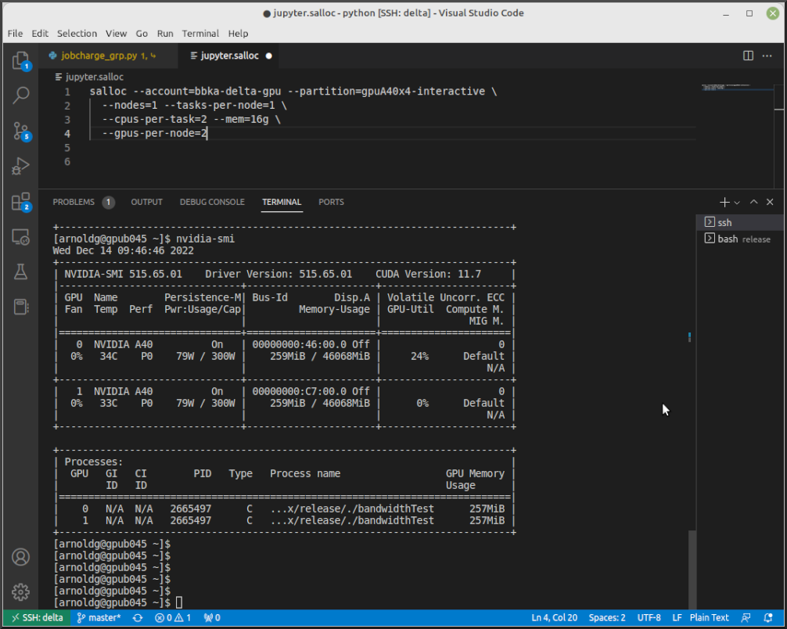
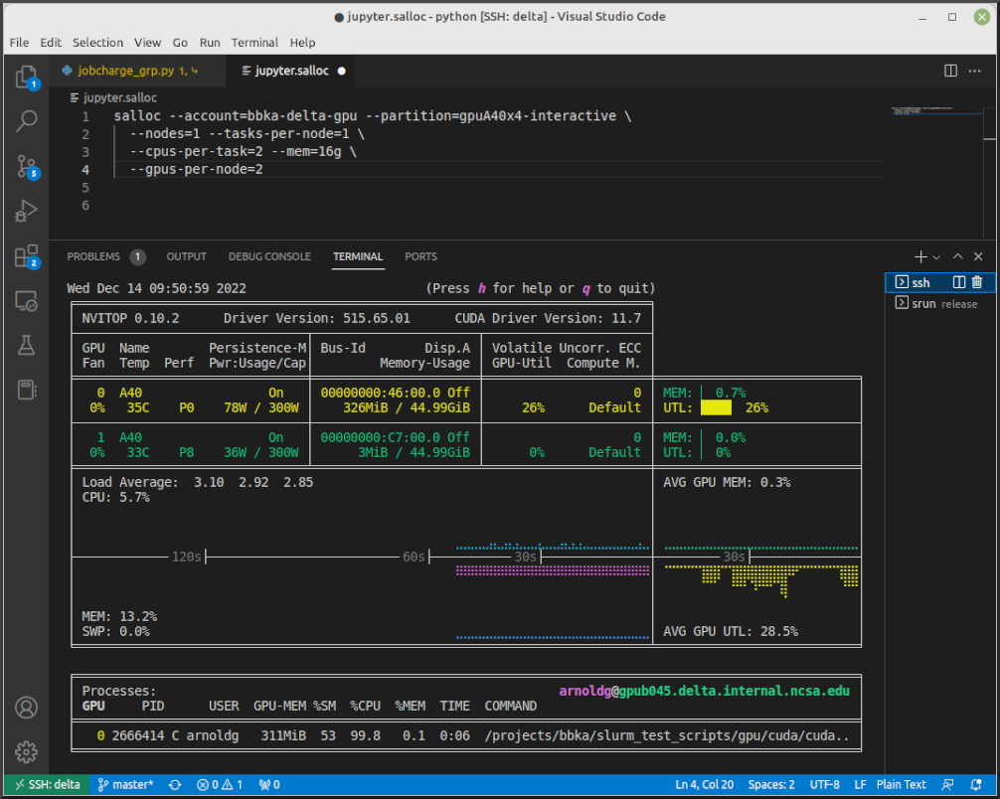

.. _mon_node:

Monitoring a Node During a Job
===============================

You have SSH access to nodes in your running job(s). Some of the basic monitoring tools are demonstrated in the example transcript below. Screen shots are appended so that you can see the output from the tools. Most common Linux utilities are available from the compute nodes (free, strace, ps, and so on).

.. code-block::

   [arnoldg@dt-login03 python]$ squeue -u $USER
                JOBID PARTITION     NAME     USER ST       TIME  NODES NODELIST(REASON)
              1214412 gpuA40x4- interact  arnoldg  R       8:14      1 gpub045
   [arnoldg@dt-login03 python]$ ssh gpub045
   gpub045.delta.internal.ncsa.edu (141.142.145.145)
     OS: RedHat 8.4   HW: HPE   CPU: 64x    RAM: 252 GB
   Last login: Wed Dec 14 09:45:26 2022 from 141.142.144.42
   [arnoldg@gpub045 ~]$ nvidia-smi

   [arnoldg@gpub045 ~]$ module load nvtop
   ---------------------------------------------------------------------------------------------------------------------
   The following dependent module(s) are not currently loaded: cuda/11.6.1 (required by: ucx/1.11.2, openmpi/4.1.2)
   ---------------------------------------------------------------------------------------------------------------------

   The following have been reloaded with a version change:
   1) cuda/11.6.1 => cuda/11.7.0

   [arnoldg@gpub045 ~]$ nvtop

   [arnoldg@gpub045 ~]$ module load anaconda3_gpu
   [arnoldg@gpub045 ~]$ nvitop

   [arnoldg@gpub045 ~]$ top -u $USER

nvidia-smi
-----------

`NVIDIA System Management Interface (nvidia-smi) <https://developer.nvidia.com/nvidia-system-management-interface>`_ is a utility for **GPUs**.

nvtop
------

`nvtop <https://manpages.ubuntu.com/manpages/focal/man1/nvtop.1.html>`_ is an interactive **GPU** process viewer.

..  figure:: ../images/slurm/nvtop.png
    :alt: nvtop

nvitop
--------

`nvitop <https://nvitop.readthedocs.io/en/latest/>`_ is an interactive **GPU** process viewer.

top -u $USER
--------------

..  figure:: ../images/slurm/top-user.png
    :alt: top

Grafana
---------

Monitor node metrics using `Grafana <https://grafana.com>`_.

#. Navigate to: https://metrics.ncsa.illinois.edu

#. Sign in (top-right).

   ..  figure:: ../images/slurm/metrics-signin-icon.png
       :alt: sign in icon

#. Navigate to the metrics of interest.

   ..  figure:: ../images/slurm/grafana-metrics-home.png
       :alt: metrics home

   You may choose a node from the list of nodes and get detailed information in real time.

   ..  figure:: ../images/slurm/grafana-metrics-details.png
       :alt: get detailed info

|
