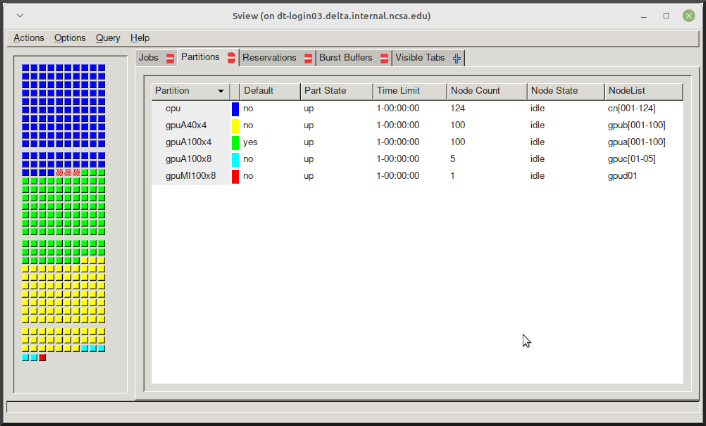

.. _slurm-monitor:

How to Manage and Monitor Jobs
=================================

Job Prioritization
-------------------

Slurm prioritizes jobs in the queue based on more than just when the job was submitted. A combination of factors are considered to fairly distribute the compute resources to cluster users. These factors include (but aren't limited to):

- Resources requested for the job: If a smaller job(s) can backfill between larger jobs without delaying higher priority jobs, the smaller job(s) may run before other jobs that were submitted earlier.
- Age of the job in the queue: Higher priority is given to jobs that have been in the queue longer. However, since this is not the only factor considered, newer jobs may run before older jobs.
- Recent account cluster usage: Higher priority is given to jobs on accounts that have *not* had recent cluster usage. Note, this is based on account usage, not just your user usage.
- Portion of total account allocation used: Higher priority is given to jobs on accounts that have used a smaller portion of their total allocation.
- Preemption: Lower priority is given to jobs that are submitted to preempt queues (where available).

If you have concerns about the prioritization of your jobs in the queue, :ref:`submit a support request <help>`.

Job Management
----------------

sview 
~~~~~~~

`sview <https://slurm.schedmd.com/sview.html>`_ is a graphical user interface (GUI) that can be used to view job, node and partition (queue) states. Run the ``sview`` command to initiate the GUI.

squeue
~~~~~~~

The ``squeue`` command is used to pull up information about batch jobs submitted to the batch system. By default, the ``squeue`` command will print out the JobID,  partition, username, job status, number of nodes, and name of nodes for all batch jobs queued or running within batch system.

.. table:: ``squeue`` command options

  ============================ ============
  Slurm Command                Description
  ============================ ============
  ``squeue -a``                List the status of all batch jobs in the batch system.
  ``squeue -u $USER``          List the status of all your batch jobs in the batch system.
  ``squeue -j JobID``          List nodes allocated to a specific running batch job in addition to basic information.
  ``scontrol show job JobID``  List detailed information on a particular batch job.
  ============================ ============

See the squeue man page for other available options.

.. code-block::

   $ sbatch tensorflow_cpu.slurm
   Submitted batch job 2337924
   $ squeue -u $USER
             JOBID PARTITION     NAME     USER ST       TIME  NODES NODELIST(REASON)
           2337924 cpu-inter    tfcpu  mylogin  R       0:46      1 cn006

If the **NODELIST(REASON)** is **MaxGRESPerAccount**, that means that a user has exceeded the number of cores or GPUs allotted per user or project for a given partition.

sinfo
~~~~~~~

The ``sinfo`` command is used to view partition and node information for a system running Slurm.

.. table:: ``sinfo`` command options

  +------------------------+----------------------------------------------------------+
  | Slurm Command          | Description                                              |
  +========================+==========================================================+
  | ``sinfo -a``           | List summary information on all the partitions (queues). |
  +------------------------+----------------------------------------------------------+
  | ``sinfo -p PRTN_NAME`` | Print information only about the specified partition(s). |
  |                        |                                                          |
  |                        | Multiple partitions are separated by commas.             |
  +------------------------+----------------------------------------------------------+

See the sinfo man page for other available options (``man sinfo``).

scontrol
~~~~~~~~~

The ``scontrol`` command can be used to view detailed information on a particular job (JobID).

.. code-block::

   scontrol show job JobID

See the scontrol man page for other available options. Note that most of the ``scontrol`` options can only be executed by user root or an administrator.

scancel
~~~~~~~~

The ``scancel`` command deletes a queued job or ends a running job.

.. table:: ``scancel`` command options

  +------------------------------+--------------------------------------------------------------------------+
  | Slurm Command                | Description                                                              |
  +==============================+==========================================================================+
  | ``scancel JobID``            | To delete/end a specific batch job                                       |
  +------------------------------+--------------------------------------------------------------------------+
  | ``scancel JobID01, JobID02`` | To delete/end multiple batch jobs, use a comma-separated list of JobIDs  |
  +------------------------------+--------------------------------------------------------------------------+
  | ``scancel -u $USER``         | To delete/end all your batch jobs (removes all your batch jobs from      |
  |                              |                                                                          |
  |                              | the batch system regardless of the batch job’s state)                    |
  +------------------------------+--------------------------------------------------------------------------+
  | ``scancel --name JobName``   | To delete/end multiple batch jobs based on the batch job’s name          |
  +------------------------------+--------------------------------------------------------------------------+

See the scancel man page for other available options.

System Maintenance Reservations
----------------------------------

Slurm will block your job from starting if there's a reservation scheduled to start before your job would finish. 

If a reservation is blocking your job from starting, ``squeue`` will return a message like ``ReqNodeNotAvail, Reserved for maintenance`` for your job.
You may be able to shorten the runtime of your job to fit in before the reservation starts.

Useful Batch Job Environment Variables
-----------------------------------------

.. table:: useful batch job environment variables

  +-------------------------+----------------------------+-------------------------------------------------------------------------+
  | Description             | Slurm Environment Variable | Detail Description                                                      |
  +=========================+============================+=========================================================================+
  | Array JobID             | $SLURM_ARRAY_JOB_ID        | Each member of a job array is assigned a unique identifier.             |
  |                         |                            |                                                                         |
  |                         | $SLURM_ARRAY_TASK_ID       |                                                                         |
  +-------------------------+----------------------------+-------------------------------------------------------------------------+
  | Job Submission Directory| $SLURM_SUBMIT_DIR          | By default, jobs start in the directory that the job was submitted      |
  |                         |                            |                                                                         |
  |                         |                            | from. So the "cd $SLURM_SUBMIT_DIR" command is not needed.              |
  +-------------------------+----------------------------+-------------------------------------------------------------------------+
  | JobID                   | $SLURM_JOB_ID              | Job identifier assigned to the job.                                     |
  +-------------------------+----------------------------+-------------------------------------------------------------------------+
  | Machine(node) list      | $SLURM_NODELIST            | Variable name that contains the list of nodes assigned to the batch job.|
  +-------------------------+----------------------------+-------------------------------------------------------------------------+

See the sbatch man page for additional environment variables available.

.. _mon_node:

Monitoring a Node During a Job
---------------------------------

You have SSH access to nodes in your running job(s). Some of the basic monitoring tools are demonstrated in the example transcript below. Screen shots are appended so that you can see the output from the tools. Most common Linux utilities are available from the compute nodes (free, strace, ps, and so on).

.. code-block::

   [arnoldg@dt-login03 python]$ squeue -u $USER
                JOBID PARTITION     NAME     USER ST       TIME  NODES NODELIST(REASON)
              1214412 gpuA40x4- interact  arnoldg  R       8:14      1 gpub045
   [arnoldg@dt-login03 python]$ ssh gpub045
   gpub045.delta.internal.ncsa.edu (141.142.145.145)
     OS: RedHat 8.4   HW: HPE   CPU: 64x    RAM: 252 GB
   Last login: Wed Dec 14 09:45:26 2022 from 141.142.144.42
   [arnoldg@gpub045 ~]$ nvidia-smi

   [arnoldg@gpub045 ~]$ module load nvtop
   ---------------------------------------------------------------------------------------------------------------------
   The following dependent module(s) are not currently loaded: cuda/11.6.1 (required by: ucx/1.11.2, openmpi/4.1.2)
   ---------------------------------------------------------------------------------------------------------------------

   The following have been reloaded with a version change:
   1) cuda/11.6.1 => cuda/11.7.0

   [arnoldg@gpub045 ~]$ nvtop

   [arnoldg@gpub045 ~]$ module load anaconda3_gpu
   [arnoldg@gpub045 ~]$ nvitop

   [arnoldg@gpub045 ~]$ top -u $USER

nvidia-smi
~~~~~~~~~~~

`NVIDIA System Management Interface (nvidia-smi) <https://developer.nvidia.com/nvidia-system-management-interface>`_ is a utility for **GPUs**.

..  figure:: ../images/slurm/nvidia-smi.png
    :alt: nvidia smi

nvtop
~~~~~~

`nvtop <https://manpages.ubuntu.com/manpages/focal/man1/nvtop.1.html>`_ is an interactive **GPU** process viewer.

..  figure:: ../images/slurm/nvtop.png
    :alt: nvtop

nvitop
~~~~~~

`nvitop <https://nvitop.readthedocs.io/en/latest/>`_ is an interactive **GPU** process viewer.

..  figure:: ../images/slurm/nvitop.png
    :alt: nvitop

top -u $USER
~~~~~~~~~~~~~~

..  figure:: ../images/slurm/top-user.png
    :alt: top

Grafana
~~~~~~~~~

Monitor node metrics using `Grafana <https://grafana.com>`_.

#. Navigate to: https://metrics.ncsa.illinois.edu

#. Sign in (top-right).

   ..  figure:: ../images/slurm/metrics-signin-icon.png
       :alt: sign in icon

#. Navigate to the metrics of interest.

   ..  figure:: ../images/slurm/grafana-metrics-home.png
       :alt: metrics home

   You may choose a node from the list of nodes and get detailed information in real time.

   ..  figure:: ../images/slurm/grafana-metrics-details.png
       :alt: get detailed info
