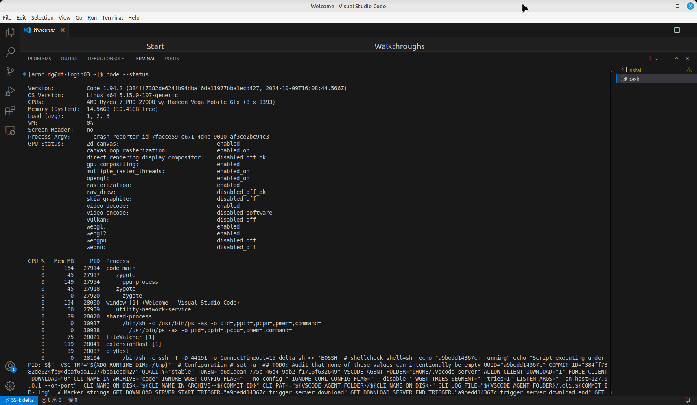

.. _vscode-trouble:

VS Code Troubleshooting 
==============================

.. _vscode-access-quota:

Cannot Log in with VS Code - Disk Quota Exceeded
-------------------------------------------------------

When you log in to a system with VS Code, VS Code must be able to write to your home directory (``~/``) on log in. Therefore, if your home directory is at its quota/limit, you will not be able to log in to the system via VS Code. To resolve this:

#. Use ``ssh`` to log in to the system in a **terminal**. 

#. Run the ``quota`` command on the system to see how much above the quota/limit you are in your **home directory**. Note, you may have reached your "Block Used" and/or "File Used" quota/limit. For a detailed explanation of the ``quota`` command output, see :ref:`quotas`.

#. Delete files in your home directory (or move them to the ``/projects``, ``/scratch``, or ``/work`` directory, as appropriate) until you are below the quota/limit.

#. After you have returned your home directory below the quota/limit, try to log in to the system using VS Code.

We have also seen cases where it was necessary to remove ``$HOME/.vscode`` on the system, similar the `VS Code documentation - clean uninstall <https://code.visualstudio.com/docs/setup/uninstall#_clean-uninstall>`_.

VS Code Performance Issues
----------------------------

See `Microsoft's VS Code Performance Issues Guide <https://github.com/Microsoft/vscode/wiki/Performance-Issues>`_ for steps to try to resolve different performance issues.

You can run ``code --status`` in a VS Code terminal to display status information about your running VS Code and the workspace you have opened.

|
