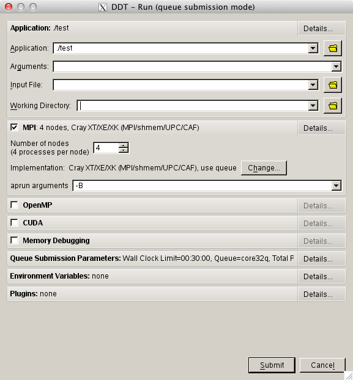
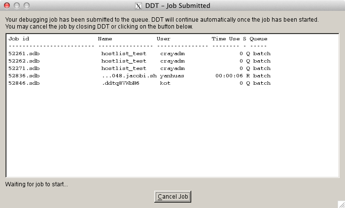
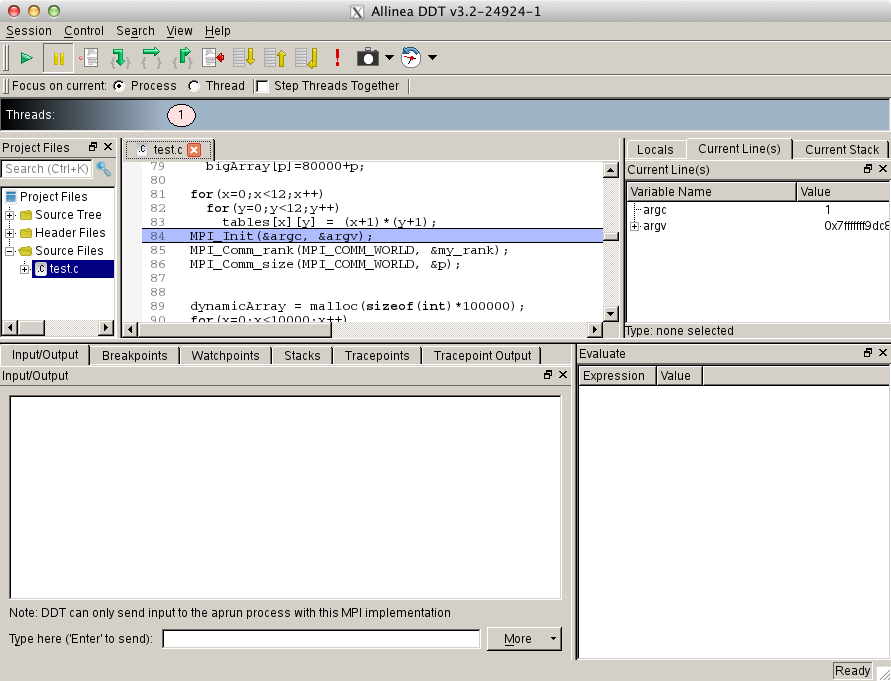
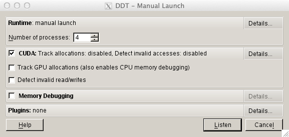
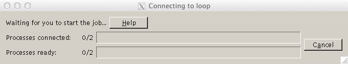
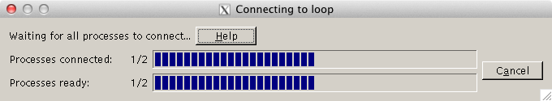
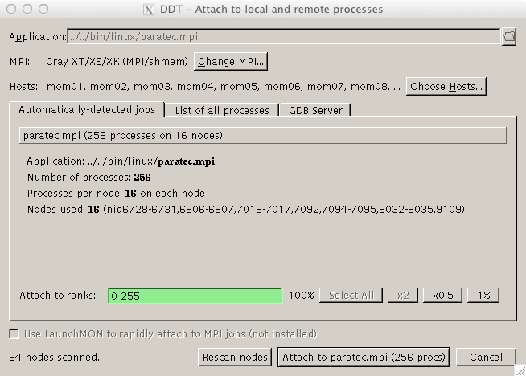
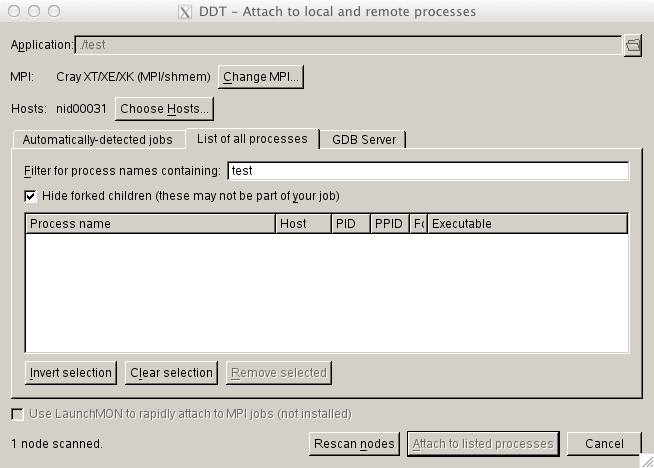
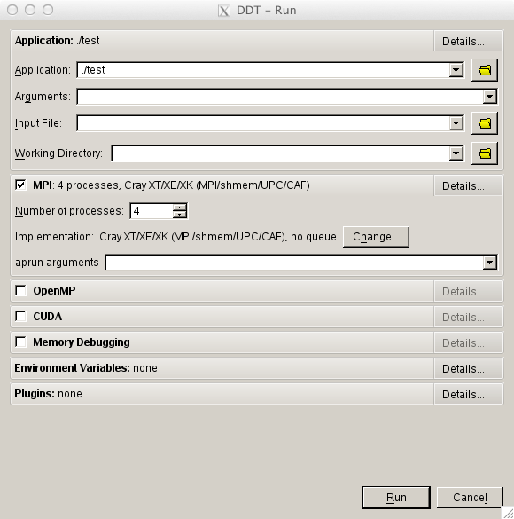

Forge (formerly known as DDT: Distributed Debugging Tool
========================================================

Description
~~~~~~~~~~~

Forge from ARM (formerly Allinea Software) is a parallel debugger that
can be used for scalar, multi-threaded and large-scale parallel
applications. The `Allinea
DDT <http://www.allinea.com/products/ddt-support>`__ web page and `users
guide <http:content.allinea.com/downloads/userguide.pdf>`__ is a good
resource for learning more about some of the advanced DDT features.
Helpful `videos <http://www.allinea.com/videos>`__ and
`blogs <http://www.allinea.com/blog>`__ are available from the Allinea
website.

-  `DDT Interactive Use <https://bluewaters.ncsa.illinois.edu/ddt>`__
-  `DDT Offline
   Use <https://bluewaters.ncsa.illinois.edu/ddt-offline>`__
-  `DDT Remote
   Client <https://bluewaters.ncsa.illinois.edu/ddt-remote-client>`__

How to use Forge/DDT
~~~~~~~~~~~~~~~~~~~~

Prerequisites
^^^^^^^^^^^^^

Since Forge/DDT is GUI-based and does not provide command line interface
X11 forwarding must be enabled for your login session. This can be done
by passing -Y flag to ssh:

::

   > ssh -Y bw-duo.ncsa.illinois.edu

NOTE: for **memory debugging** load the memory debugging module for
Forge/DDT BEFORE linking

> module load forge # no memory debugging

or

> module load ddt-memdebug # with memory debugging

Compilation
^^^^^^^^^^^

MMini ~/work/RTD_from_bw_portal/extras/debugging $ more bw_debugging.rst 
Forge (formerly known as DDT: Distributed Debugging Tool
========================================================

Description
~~~~~~~~~~~

Forge from ARM (formerly Allinea Software) is a parallel debugger that
can be used for scalar, multi-threaded and large-scale parallel
applications. The `Allinea
DDT <http://www.allinea.com/products/ddt-support>`__ web page and `users
guide <http:content.allinea.com/downloads/userguide.pdf>`__ is a good
resource for learning more about some of the advanced DDT features.
Helpful `videos <http://www.allinea.com/videos>`__ and
`blogs <http://www.allinea.com/blog>`__ are available from the Allinea
website.

-  `DDT Interactive Use <https://bluewaters.ncsa.illinois.edu/ddt>`__
-  `DDT Offline
   Use <https://bluewaters.ncsa.illinois.edu/ddt-offline>`__
-  `DDT Remote
   Client <https://bluewaters.ncsa.illinois.edu/ddt-remote-client>`__

How to use Forge/DDT
~~~~~~~~~~~~~~~~~~~~

Prerequisites
^^^^^^^^^^^^^

Since Forge/DDT is GUI-based and does not provide command line interface
X11 forwarding must be enabled for your login session. This can be done
by passing -Y flag to ssh:

::

   > ssh -Y bw-duo.ncsa.illinois.edu

NOTE: for **memory debugging** load the memory debugging module for
Forge/DDT BEFORE linking

> module load forge # no memory debugging

or

> module load ddt-memdebug # with memory debugging

Compilation
^^^^^^^^^^^

Add -g flag to enable the generation of debugging information used by
DDT, then (re)compile your program:

Fortran example

::

   > ftn -g test.f90 -o test

C example:

::

   > cc -g test.c -o test

Starting a debug session with DDT
^^^^^^^^^^^^^^^^^^^^^^^^^^^^^^^^^

-  submit a job through DDT
-  manually launch a program with DDT
-  attach DDT to a running program
-  start a debug session from inside an interactive job

The first three ways begin by loading the ddt module and starting DDT:

::

   > module unload altd ; module unload xalt
   > module load ddt-memdebug # (note the use of the ddt-memdebug module from above)
   > export DDT_NODE_SCAN_TIMEOUT=90
   > export DDT_NO_TIMEOUT=1
   > export DDT_PROCESS_TIMEOUT=0
   > forge

.. image:: ddt-welcome.png

Submit a job through Forge/DDT
''''''''''''''''''''''''''''''

Submits a job, waits until the job is scheduled, and starts a debug
session.

Click on Run and Debug a Program . A new window with expandable tabs
will appear, click on Details... to expand a tab.

**Application** tab is used to select a program binary, working
directory, arguments and input file.

**MPI**, **OpenMP**, **CUDA** and **Memory Debugging** tabs are used to
allow respective features and set parameters (e.g., number of nodes and
processes per node for an MPI program).

**Queue Submission Parameters** tab is used to change job parameters
such as wall clock time, target queue, etc.

Clicking on Submit button will submit a job to the scheduler, DDT will
wait for the job to start.

DDT will start a debug session automatically as soon as the job starts.

Manually launch a program
'''''''''''''''''''''''''

Manual launch allows debugging multi-process and multi-executable
programs.

To launch a program manually click on Manually Launch a Program button.

Select how many processes you want to debug and click on Listen . At
this point start a program or programs using the following command:

::

   > forge-client <path-to-program-binary>

Note, *ddt-client* command must be issues for each process selected at
the previous window. The above command can also be used in a job
submission script.

Forge/DDT will automatically start debugging session once all requested
programs have been launched manually.

Attach to a running program
'''''''''''''''''''''''''''

To attach to a program that is already running, click on the "ATTACH -
Attach to an already running program" button.

(With nodes=256 or more, start ddt from the command line with:
DDT_NODE_SCAN_TIMEOUT=90 ddt )

DDT will scan each of the 64 mom nodes and locate all of the active jobs
that you own, which will appear in the "Automatically-detected jobs"
tab. Select the desired job, and click on the "Attach to [job name]"
button.

Alternatively, you can attach to a specific process that you own on the
"List of all processes" tab.

If you are unable to attach to running jobs or processes (e.g., if they
aren't listed), clear out all previously saved Forge settings by
removing the ~/.allinea directory, quit Forge and reload it, and then
try attaching again.

Start a debug session from inside an interactive job
''''''''''''''''''''''''''''''''''''''''''''''''''''

To start DDT from an interactive job, X11 forwarding must be enabled
(*-X* flag):

::

   > qsub -I -X

Once the job has started load the ddt module and start DDT with
*-noqueue* flag:

::

   > module load ddt-memdebug
   > forge -noqueue

Click on Run and Debug a Program . A new window with expandable tabs
will appear. Tabs **Application**, **MPI**, **OpenMP**, **CUDA** and
**Memory Debugging** are the same as described above.

|DDT Run No Queue|

Click on Run button to start a debug session.

.. |DDT - Welcome| image:: https://bluewaters.ncsa.illinois.edu/image/image_gallery?img_id=16928&igImageId=16927&igSmallImage=1&t=1352320586366
   :target: https://bluewaters.ncsa.illinois.edu/image/image_gallery?uuid=9b84c1e0-bb90-4d21-8069-7d6f69610931&groupId=10157&t=1352323436739
.. |DDT - Run| image:: https://bluewaters.ncsa.illinois.edu/image/image_gallery?img_id=16920&igImageId=16919&igSmallImage=1&t=1352320586357
   :target: https://bluewaters.ncsa.illinois.edu/image/image_gallery?uuid=ad9c35e9-cb50-4881-bc64-a7239252f86a&groupId=10157&t=1352323436726
.. |DDT - Job Submitted| image:: https://bluewaters.ncsa.illinois.edu/image/image_gallery?img_id=16924&igImageId=16923&igSmallImage=1&t=1352320586362
   :target: https://bluewaters.ncsa.illinois.edu/image/image_gallery?uuid=23813c6b-b1bf-418a-b275-31b40d460ae1&groupId=10157&t=1352323436733
.. |DDT Debug Session| image:: https://bluewaters.ncsa.illinois.edu/image/image_gallery?img_id=16908&igImageId=16907&igSmallImage=1&t=1352320586344
   :target: https://bluewaters.ncsa.illinois.edu/image/image_gallery?uuid=ba277c54-1d69-47ef-b9cc-4626154fadb8&groupId=10157&t=1352323436706
.. |image1| image:: https://bluewaters.ncsa.illinois.edu/image/image_gallery?img_id=16916&igImageId=16915&igSmallImage=1&t=1352320586353
   :target: https://bluewaters.ncsa.illinois.edu/image/image_gallery?uuid=1ebb7802-c094-44ae-90fc-5064e100e253&groupId=10157&t=1352323436720
.. |DDT - Connecting| image:: https://bluewaters.ncsa.illinois.edu/image/image_gallery?img_id=16900&igImageId=16899&igSmallImage=1&t=1352320586330
   :target: https://bluewaters.ncsa.illinois.edu/image/image_gallery?uuid=aee59b8c-714f-4525-95cb-04adf591542c&groupId=10157&t=1352322163550
.. |DDT - Connected| image:: https://bluewaters.ncsa.illinois.edu/image/image_gallery?img_id=16904&igImageId=16903&igSmallImage=1&t=1352320586339
   :target: https://bluewaters.ncsa.illinois.edu/image/image_gallery?uuid=c68388fe-4764-4948-b939-33c7e53b5324&groupId=10157&t=1352322163573
.. |DDT - Attach - Found| image:: https://bluewaters.ncsa.illinois.edu/image/image_gallery?img_id=16939&igImageId=16938&igSmallImage=1&t=1352322163618
   :target: https://bluewaters.ncsa.illinois.edu/image/image_gallery?uuid=494f7779-3b60-41b5-890f-19784d68cb76&groupId=10157&t=1352322163618
.. |DDT - Attach| image:: https://bluewaters.ncsa.illinois.edu/image/image_gallery?img_id=16912&igImageId=16911&igSmallImage=1&t=1352320586348
   :target: https://bluewaters.ncsa.illinois.edu/image/image_gallery?uuid=6fec622c-3aed-4d60-ab7c-34b2e7a46e7a&groupId=10157&t=1352322163586
.. |DDT Run No Queue| image:: https://bluewaters.ncsa.illinois.edu/image/image_gallery?img_id=19983&igImageId=19982&igSmallImage=1&t=1358887652345
   :target: https://bluewaters.ncsa.illinois.edu/image/image_gallery?uuid=ebe57654-0682-4f38-a0f4-016405acc3df&groupId=10157&t=1358887652345
MMini ~/work/RTD_from_bw_portal/extras/debugging $ 
