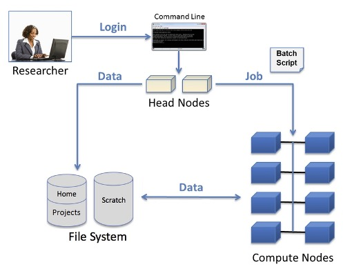

Introduction
------------

The basic building block of a Linux cluster is a *node*. 
A node is an individual computer in the cluster. On a cluster, there are different types of nodes to perform specific tasks. 
The two primary types of nodes on a cluster are:

-  **Compute nodes** — Compute nodes are the majority of nodes on a cluster and are the nodes that run user jobs.
-  **Login (Head) nodes** — There is at least one head node on a cluster. Head nodes are where you log in from your local computer (laptop/desktop).

ead/written from the compute nodes to the scratch directory.
   :align: center

User access to the compute nodes is only available via a *batch job*. 
This is typically a sequence of commands listed in a file called a *batch script* that can be executed without the intervention of the user. 
The batch script is a plain text file that starts with *directives* that describe the requirements of the job such as the number of nodes and wall clock time, followed by the user’s commands to execute specific tasks or run specific code. 
An *interactive batch job* provides a way to get interactive access to a compute node via a batch job; this is useful for testing and debugging.

From the head nodes, the batch job is submitted to a *queue* to be scheduled to run when the compute node resources requested are available. 
On the head nodes, users can also:

- Check the status of batch jobs
- Monitor the progress of batch jobs
- Delete batch jobs 

.. warning::

   The login (head) nodes are a shared resource for all users of the system. Computational use of the head nodes should be limited to editing, compiling, and for short non-intensive runs. 
   The administrators may terminate user processes on the head nodes that impact the system *without warning*. 
   Users should do all production work by submitting jobs to the batch system.
