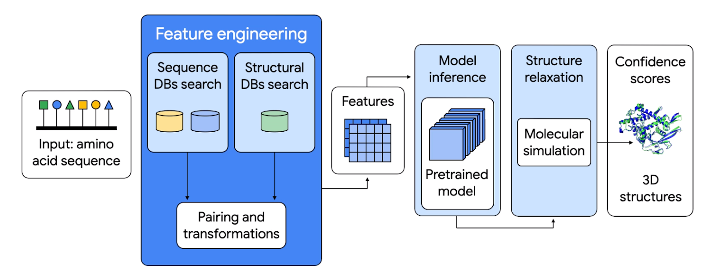

Alphafold
==============

AlphaFold is an artificial intelligence (AI) program originally developed by Google DeepMind to predict the 3D structure of proteins from the corresponding amino acid sequences. The latest version, AlphaFold 3, can predict the structures of a broader range of biomolecules than just proteins. This includes DNA, RNA, and ligands. For a broad overview of AlphaFold 3, see `AlphaFold 3 predicts the structure and interactions of all of life’s molecules <https://blog.google/technology/ai/google-deepmind-isomorphic-alphafold-3-ai-model/#life-molecules>`__. For a more detailed view of the inner workings of AlphaFold 3, see `The Illustrated AlphaFold <https://elanapearl.github.io/blog/2024/the-illustrated-alphafold/>`__.

The AlphaFold inference pipeline can be broadly divided into two steps, as shown in the picture below (taken from `Boost medical discoveries with AlphaFold on Vertex AI <https://cloud.google.com/blog/topics/developers-practitioners/boost-medical-discoveries-alphafold-vertex-ai>`__):

#. Feature engineering: generate features from input sequence
#. Inference: predict molecule structure, along with confidence scores, from generated features

           
